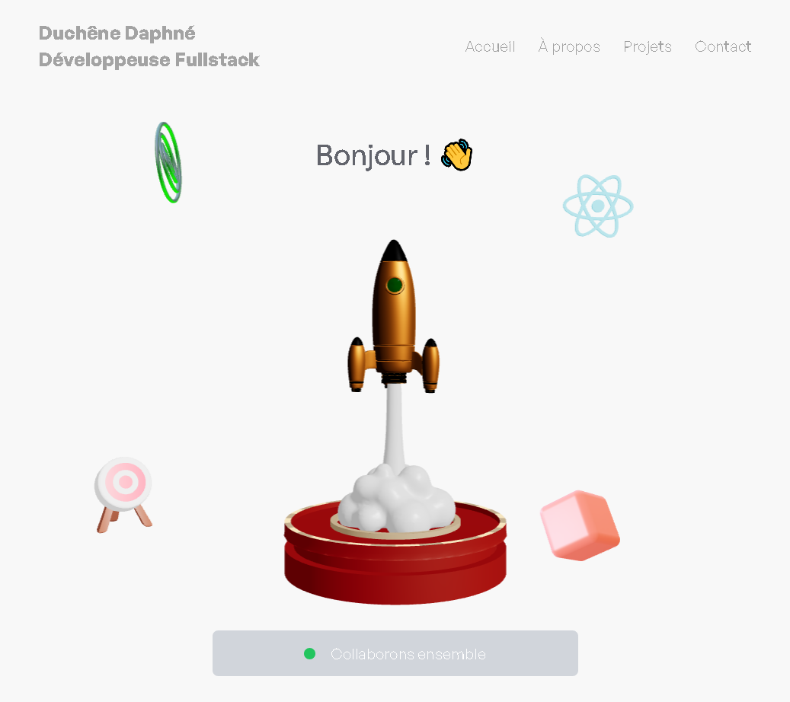

# My first 3D app

This is my first real time animated 3D application,  
built using React Three Fiber and React Three Drei for WebGL rendering.

## 🛠 Tech Stack

- React  
- Vite JS  
- JavaScript  
- React Three Fiber  
- React Three Drei  
- GSAP  
- Tailwind CSS  
- Blender

## 🚀 Features

- Interactive 3D Model:  
A GLB model created with Blender, imported and animated in the scene.

- Camera Controls:  
Implemented using CameraControls from React Three Drei for smooth user navigation.

- Click Interaction:  
Rotation effect on model when clicked.

- Optimized Performance:  
Efficient rendering and animations using React Three Fiber.

- Responsive Design:  
Styled with Tailwind CSS for a flexible and modern UI.

You can test it [here](https://duchenedaphne.github.io/three-d-app/).

## ✍ Author
Daphné Duchêne
